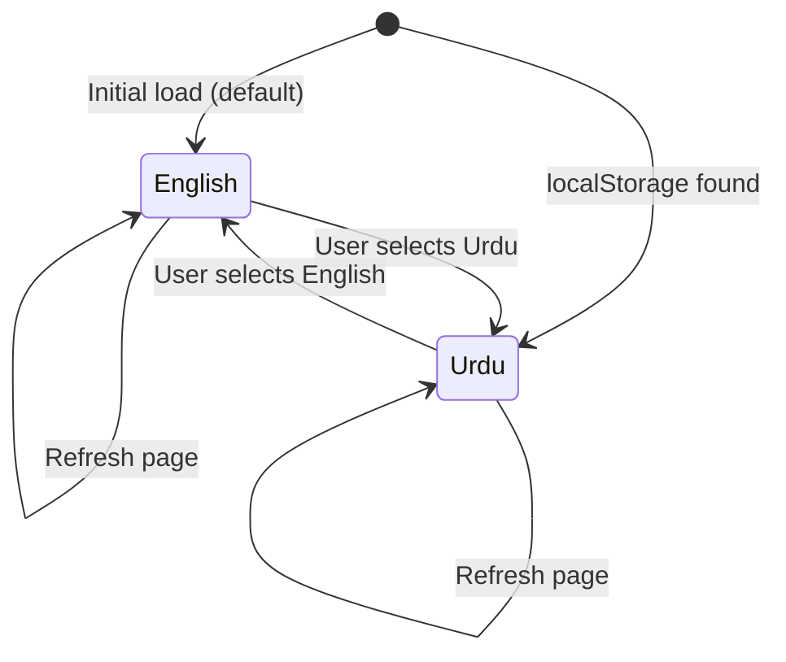
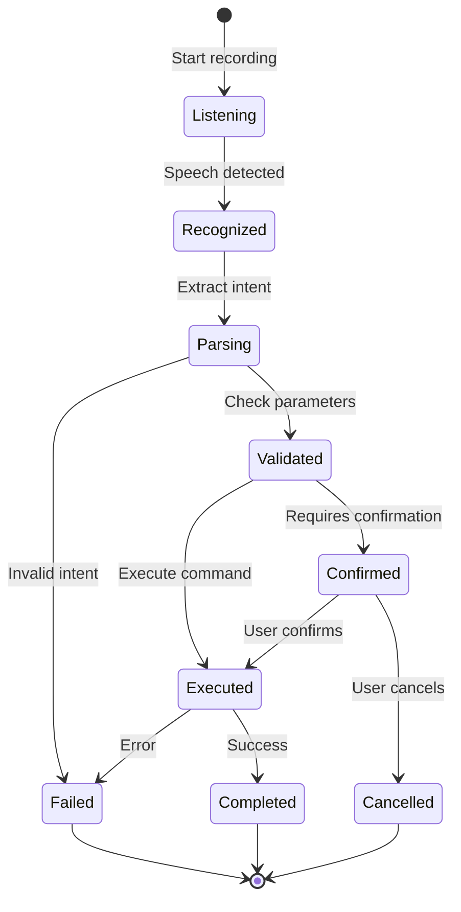
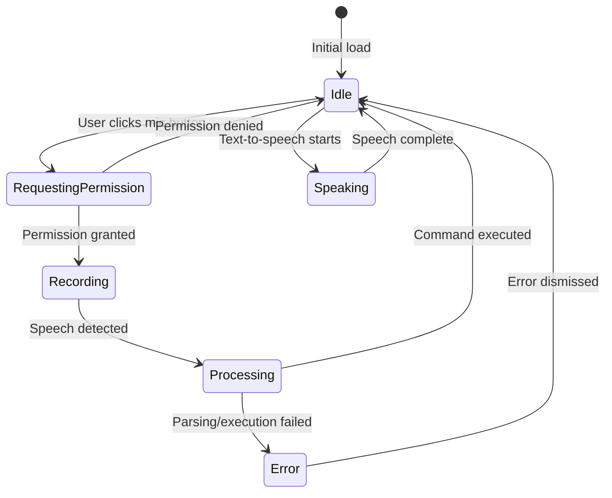

# Data Model: Bonus Features - Multi-language Support & Voice Commands

**Branch**: `008-bonus-features-i18n-voice` | **Date**: 2025-12-31
**Input**: [Feature specification](./spec.md) and [Research decisions](./research.md)

## Summary

This document defines all state management entities, data structures, and state transitions for Multi-language Support (Urdu) and Voice Commands features. Since these are frontend-only enhancements, no database schema changes are required.

---

## Entity 1: LanguagePreference

**Purpose**: Store and manage user's selected language preference

### Fields

| Field | Type | Required | Default | Description |
|-------|------|----------|---------|-------------|
| `locale` | `string` | ✅ | `"en"` | Language code: `"en"` (English) or `"ur"` (Urdu) |
| `lastUpdated` | `number` | ✅ | `Date.now()` | Unix timestamp of last preference update |

### Storage

- **Location**: Browser `localStorage`
- **Key**: `user-language-preference`
- **Format**: JSON string

```typescript
interface LanguagePreference {
  locale: 'en' | 'ur';
  lastUpdated: number;
}

// Example localStorage value
{
  "locale": "ur",
  "lastUpdated": 1735689600000
}
```

### Validation Rules

1. **Locale Validation**: Must be one of supported locales (`"en"` or `"ur"`)
2. **Timestamp Validation**: Must be valid Unix timestamp (positive integer)
3. **Fallback**: If invalid or missing, default to `"en"`

### State Transitions



**State Diagram Description**:
- **Initial Load**: Check localStorage → if found, use saved preference; else default to English
- **User Selection**: Update localStorage + trigger React context update
- **Page Refresh**: Read from localStorage (persistent preference)

### Operations

| Operation | Input | Output | Side Effects |
|-----------|-------|--------|--------------|
| `getLanguagePreference()` | None | `LanguagePreference` | Read from localStorage |
| `setLanguagePreference(locale)` | `locale: 'en' \| 'ur'` | `void` | Write to localStorage, update React context |
| `clearLanguagePreference()` | None | `void` | Remove from localStorage, reset to default |

---

## Entity 2: VoiceCommand

**Purpose**: Represent a parsed voice command with intent and parameters

### Fields

| Field | Type | Required | Default | Description |
|-------|------|----------|---------|-------------|
| `transcript` | `string` | ✅ | N/A | Raw speech recognition output |
| `intent` | `VoiceIntent` | ✅ | N/A | Parsed command intent (enum) |
| `parameters` | `Record<string, any>` | ✅ | `{}` | Extracted command parameters |
| `confidence` | `number` | ✅ | N/A | Recognition confidence (0-1) |
| `timestamp` | `number` | ✅ | `Date.now()` | Unix timestamp of recognition |
| `locale` | `string` | ✅ | `"en"` | Language of spoken command |

### Types

```typescript
type VoiceIntent =
  | 'CREATE_TASK'
  | 'COMPLETE_TASK'
  | 'DELETE_TASK'
  | 'UPDATE_TASK'
  | 'FILTER_TASKS'
  | 'READ_TASKS'
  | 'SHOW_HELP'
  | 'UNKNOWN';

interface VoiceCommand {
  transcript: string;
  intent: VoiceIntent;
  parameters: Record<string, any>;
  confidence: number;
  timestamp: number;
  locale: 'en' | 'ur';
}
```

### Example Instances

```typescript
// Example 1: Create task
{
  transcript: "add task Daily standup meeting",
  intent: "CREATE_TASK",
  parameters: { title: "Daily standup meeting" },
  confidence: 0.95,
  timestamp: 1735689600000,
  locale: "en"
}

// Example 2: Complete task
{
  transcript: "complete task 5",
  intent: "COMPLETE_TASK",
  parameters: { id: "5" },
  confidence: 0.92,
  timestamp: 1735689601000,
  locale: "en"
}

// Example 3: Filter tasks (Urdu)
{
  transcript: "اعلیٰ ترجیح کے کام دکھائیں",
  intent: "FILTER_TASKS",
  parameters: { priority: "high" },
  confidence: 0.88,
  timestamp: 1735689602000,
  locale: "ur"
}

// Example 4: Unknown command
{
  transcript: "play music",
  intent: "UNKNOWN",
  parameters: {},
  confidence: 0.65,
  timestamp: 1735689603000,
  locale: "en"
}
```

### Validation Rules

1. **Transcript**: Non-empty string
2. **Intent**: Must be valid `VoiceIntent` enum value
3. **Confidence**: Number between 0 and 1 (inclusive)
4. **Parameters**: Object with intent-specific fields (validated per intent)
5. **Locale**: Must be `"en"` or `"ur"`

### State Lifecycle



**Lifecycle States**:
1. **Listening**: Microphone active, waiting for speech
2. **Recognized**: Speech-to-text conversion complete
3. **Parsing**: Extracting intent and parameters from transcript
4. **Validated**: Command structure verified, parameters extracted
5. **Confirmed**: Awaiting user confirmation (for destructive actions)
6. **Executed**: Command sent to API
7. **Completed**: Command executed successfully
8. **Failed**: Recognition failed, parsing failed, or execution error
9. **Cancelled**: User cancelled confirmation

---

## Entity 3: TranslationString

**Purpose**: Represent a single translatable UI string with all language variants

### Fields

| Field | Type | Required | Default | Description |
|-------|------|----------|---------|-------------|
| `key` | `string` | ✅ | N/A | Dot-notation translation key (e.g., `tasks.list.title`) |
| `en` | `string` | ✅ | N/A | English translation |
| `ur` | `string` | ✅ | N/A | Urdu translation |
| `namespace` | `string` | ✅ | N/A | Top-level namespace (e.g., `tasks`, `common`) |
| `component` | `string` | ❌ | `null` | Component/page identifier (e.g., `list`, `form`) |
| `description` | `string` | ❌ | `""` | Human-readable description for translators |

### Types

```typescript
interface TranslationString {
  key: string;
  en: string;
  ur: string;
  namespace: string;
  component?: string;
  description?: string;
}
```

### Example Instances

```typescript
// Example 1: Common button
{
  key: "common.buttons.save",
  en: "Save",
  ur: "محفوظ کریں",
  namespace: "common",
  component: "buttons",
  description: "Save button label used across the application"
}

// Example 2: Task list
{
  key: "tasks.list.title",
  en: "My Tasks",
  ur: "میرے کام",
  namespace: "tasks",
  component: "list",
  description: "Title for the main task list page"
}

// Example 3: Voice command error
{
  key: "voice.errors.not_supported",
  en: "Voice commands are not supported in this browser. Try Chrome or Edge.",
  ur: "اس براؤزر میں آواز کی کمانڈز معاون نہیں ہیں۔ کروم یا ایج استعمال کریں۔",
  namespace: "voice",
  component: "errors",
  description: "Error message when Web Speech API is not available"
}
```

### Organization Strategy

**Namespace Structure**: `{namespace}.{component}.{element}`

| Namespace | Description | Example Keys |
|-----------|-------------|--------------|
| `common` | Shared UI elements across all pages | `common.buttons.save`, `common.errors.network` |
| `tasks` | Task management pages | `tasks.list.title`, `tasks.form.description` |
| `voice` | Voice command UI | `voice.button.start`, `voice.status.listening` |
| `settings` | Settings page | `settings.language.title`, `settings.voice.enable` |
| `auth` | Authentication pages | `auth.login.title`, `auth.signup.submit` |

### Validation Rules

1. **Key Uniqueness**: Each key must be unique across all translation files
2. **Completeness**: Every key in `en.json` must exist in `ur.json` and vice versa
3. **No Empty Values**: All translation strings must be non-empty
4. **Key Format**: Must follow dot-notation pattern `namespace.component?.element`
5. **Placeholder Consistency**: Placeholders (e.g., `{name}`) must match across languages

### Storage Format

**File**: `src/messages/en.json`
```json
{
  "common": {
    "buttons": {
      "save": "Save",
      "cancel": "Cancel",
      "delete": "Delete"
    },
    "errors": {
      "network": "Network error. Please try again.",
      "validation": "Please check your input."
    }
  },
  "tasks": {
    "list": {
      "title": "My Tasks",
      "empty": "No tasks yet. Create your first task!",
      "count": "You have {count} tasks"
    }
  }
}
```

**File**: `src/messages/ur.json`
```json
{
  "common": {
    "buttons": {
      "save": "محفوظ کریں",
      "cancel": "منسوخ کریں",
      "delete": "حذف کریں"
    },
    "errors": {
      "network": "نیٹ ورک کی خرابی۔ براہ کرم دوبارہ کوشش کریں۔",
      "validation": "براہ کرم اپنا ان پٹ چیک کریں۔"
    }
  },
  "tasks": {
    "list": {
      "title": "میرے کام",
      "empty": "ابھی تک کوئی کام نہیں۔ اپنا پہلا کام بنائیں!",
      "count": "آپ کے پاس {count} کام ہیں"
    }
  }
}
```

---

## Entity 4: VoiceRecordingState

**Purpose**: Track current state of voice recording and recognition

### Fields

| Field | Type | Required | Default | Description |
|-------|------|----------|---------|-------------|
| `isRecording` | `boolean` | ✅ | `false` | Whether microphone is currently recording |
| `isSpeaking` | `boolean` | ✅ | `false` | Whether text-to-speech is currently playing |
| `isProcessing` | `boolean` | ✅ | `false` | Whether command is being parsed/executed |
| `interimTranscript` | `string` | ✅ | `""` | Partial speech recognition result (real-time) |
| `finalTranscript` | `string` | ✅ | `""` | Complete speech recognition result |
| `error` | `VoiceError \| null` | ✅ | `null` | Current error state |
| `permissionStatus` | `PermissionState` | ✅ | `"prompt"` | Microphone permission status |

### Types

```typescript
type PermissionState = 'prompt' | 'granted' | 'denied';

interface VoiceError {
  code: string;
  message: string;
  timestamp: number;
}

interface VoiceRecordingState {
  isRecording: boolean;
  isSpeaking: boolean;
  isProcessing: boolean;
  interimTranscript: string;
  finalTranscript: string;
  error: VoiceError | null;
  permissionStatus: PermissionState;
}
```

### Example States

```typescript
// State 1: Idle (initial)
{
  isRecording: false,
  isSpeaking: false,
  isProcessing: false,
  interimTranscript: "",
  finalTranscript: "",
  error: null,
  permissionStatus: "prompt"
}

// State 2: Recording (user speaking)
{
  isRecording: true,
  isSpeaking: false,
  isProcessing: false,
  interimTranscript: "add task mee",
  finalTranscript: "",
  error: null,
  permissionStatus: "granted"
}

// State 3: Processing (command complete)
{
  isRecording: false,
  isSpeaking: false,
  isProcessing: true,
  interimTranscript: "",
  finalTranscript: "add task Daily standup meeting",
  error: null,
  permissionStatus: "granted"
}

// State 4: Speaking (text-to-speech active)
{
  isRecording: false,
  isSpeaking: true,
  isProcessing: false,
  interimTranscript: "",
  finalTranscript: "",
  error: null,
  permissionStatus: "granted"
}

// State 5: Error (permission denied)
{
  isRecording: false,
  isSpeaking: false,
  isProcessing: false,
  interimTranscript: "",
  finalTranscript: "",
  error: {
    code: "PERMISSION_DENIED",
    message: "Microphone permission denied. Please allow access in browser settings.",
    timestamp: 1735689600000
  },
  permissionStatus: "denied"
}
```

### State Transitions



**State Description**:
1. **Idle**: No active recording or speech, ready for user input
2. **RequestingPermission**: Awaiting browser microphone permission
3. **Recording**: Microphone active, capturing speech
4. **Processing**: Speech complete, parsing command and executing
5. **Speaking**: Text-to-speech playing (reading tasks aloud)
6. **Error**: Error state, showing error message to user

### Operations

| Operation | Input | Output | State Change |
|-----------|-------|--------|--------------|
| `startRecording()` | None | `void` | `isRecording: true` |
| `stopRecording()` | None | `void` | `isRecording: false` |
| `updateInterimTranscript(text)` | `text: string` | `void` | `interimTranscript: text` |
| `setFinalTranscript(text)` | `text: string` | `void` | `finalTranscript: text, isProcessing: true` |
| `startSpeaking()` | None | `void` | `isSpeaking: true` |
| `stopSpeaking()` | None | `void` | `isSpeaking: false` |
| `setError(error)` | `error: VoiceError` | `void` | `error: error, isRecording: false` |
| `clearError()` | None | `void` | `error: null` |
| `reset()` | None | `void` | Reset all fields to defaults |

---

## State Management Architecture

### React Context Structure

```typescript
// Language Context
interface LanguageContextValue {
  locale: 'en' | 'ur';
  setLocale: (locale: 'en' | 'ur') => void;
  t: (key: string, params?: Record<string, any>) => string;
}

// Voice Context
interface VoiceContextValue {
  state: VoiceRecordingState;
  startRecording: () => Promise<void>;
  stopRecording: () => void;
  speakText: (text: string, locale?: 'en' | 'ur') => Promise<void>;
  stopSpeaking: () => void;
}
```

### Data Flow

```
User Action
    ↓
React Component
    ↓
Context Hook (useLanguage / useVoiceCommands)
    ↓
State Update (React State / localStorage)
    ↓
UI Re-render
```

---

## Persistence Strategy

### localStorage Schema

| Key | Value Type | Purpose |
|-----|------------|---------|
| `user-language-preference` | `LanguagePreference` (JSON) | User's selected language |

**No persistence required for**:
- Voice commands (ephemeral, not stored)
- Translation strings (bundled in build, not dynamic)
- Voice recording state (session-only, reset on page load)

---

## Validation Summary

### Pre-conditions (before state updates)

1. **Language Selection**: Locale must be `"en"` or `"ur"`
2. **Voice Command**: Transcript must be non-empty, confidence >= 0.6
3. **Translation Key**: Key must exist in both `en.json` and `ur.json`
4. **Microphone Permission**: Must be granted before recording

### Post-conditions (after state updates)

1. **Language Preference**: localStorage must be updated + React context must re-render
2. **Voice Command**: API call must be triggered + UI must show feedback
3. **Translation String**: UI must display correct language text immediately

---

## Performance Considerations

### Memory Footprint

| Entity | Instances | Size per Instance | Total |
|--------|-----------|-------------------|-------|
| LanguagePreference | 1 | ~50 bytes | 50 bytes |
| VoiceCommand | 1 (current only) | ~200 bytes | 200 bytes |
| TranslationString | 500-1000 | ~100 bytes | 50-100KB |
| VoiceRecordingState | 1 | ~100 bytes | 100 bytes |

**Total**: ~50-100KB (negligible, well within acceptable range)

### State Update Frequency

- **Language Preference**: Updated rarely (once per user session, if at all)
- **Voice Recording State**: Updated frequently during recording (every 100ms for interim transcripts)
- **Translation Strings**: Read-only after initial load (no updates)
- **Voice Command**: Created once per command (1-10 times per minute during active use)

---

## Error States

### Language Preference Errors

| Error | Cause | Recovery |
|-------|-------|----------|
| Invalid locale | Corrupted localStorage | Reset to default `"en"` |
| localStorage unavailable | Browser privacy mode | Use in-memory fallback, warn user |

### Voice Command Errors

| Error | Cause | Recovery |
|-------|-------|----------|
| Permission denied | User denied microphone access | Show error message with instructions |
| Not supported | Browser lacks Web Speech API | Hide voice UI, show error |
| No speech detected | User silent during recording | Timeout after 5 seconds, reset |
| Low confidence | Noisy environment, unclear speech | Ask user to repeat |
| Unknown intent | Command doesn't match any pattern | Show "Command not recognized" message |

---

## Summary

This data model defines 4 core entities for Multi-language Support and Voice Commands:

1. **LanguagePreference**: User's selected language (persistent in localStorage)
2. **VoiceCommand**: Parsed voice input with intent and parameters (ephemeral)
3. **TranslationString**: UI text in all supported languages (static, bundled)
4. **VoiceRecordingState**: Current voice recording/speaking state (session-only)

All entities are frontend-only with no database changes required, maintaining compatibility with existing Phase V architecture.
